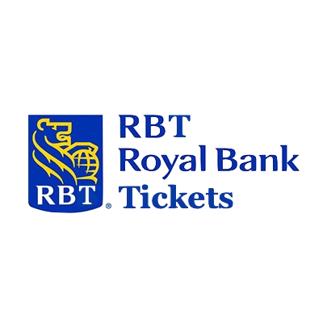
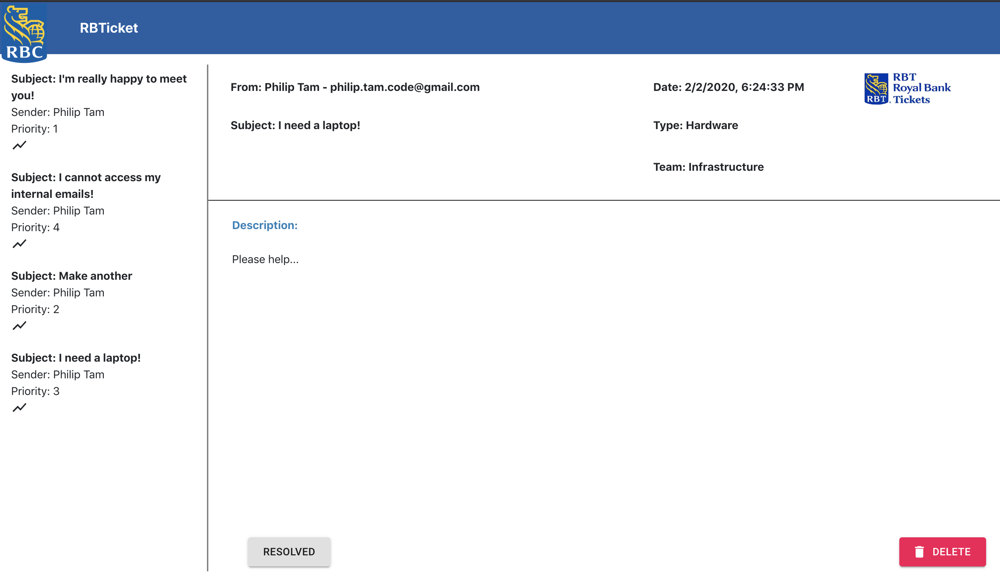
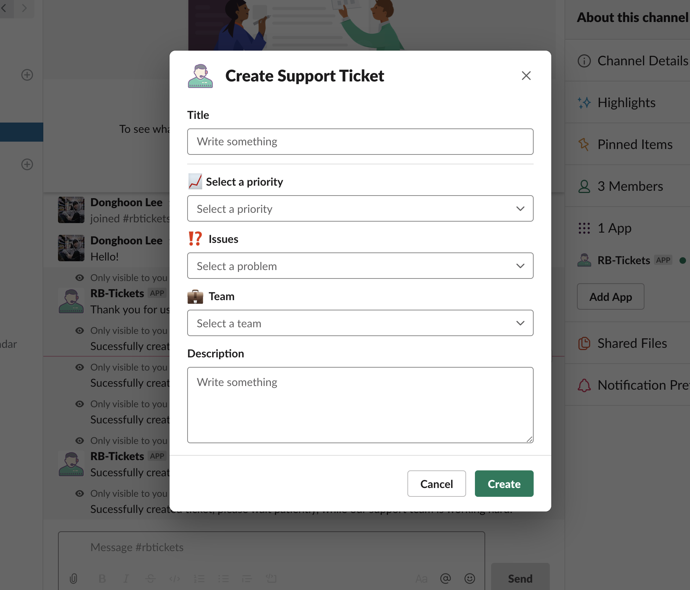

# RBTickets

* Using Slack channel or in general messaging websites to have a built-in implementation of Helpdesk.

## Inspiration

* When it comes to submitting tickets to resolve issues, it sometimes takes few minutes or even more to call and wait to be processed. We thought it can be improved and those time should be used in such a better way than waiting for small issues to be resolved. Employees' time and convenience are important for companies, we thought that it would be beneficial to companies if they have a built-in Helpdesk for commonly used message application. It can save a ton of time and resources of creating and submitting issues. It can also have more features involved since message app already has many features included themselves

## What it does

* This slack integration is similar to slack-bot, which hears inconvenience of users, but instead, it focuses on users' needs so that we can create and submit tickets in a more accessible and feasible way. It can be simply done by sending a message to slack integration by an implemented command.

`/ticket`

* Once this command is delivered, then it directs to the slack Helpdesk, and the ticket is now submitted. Users can also experience a website so they can see a process and once it is resolved, it disappears from dashboard, so they can see a progress immediately. It saves everyone's miscellaneous time and effort to create ticket via Helpdesk on the other platform.

## How My team built it

* RBTickets can be mainly divided into two parts, a front-end and a back-end. A front-end part is done using javascript and react, it is focused on delivering an easy and accessible web to people so we made it one-paged website that can show which issues are resolved. We used CSS code to beautify the interface design and Javascript code to make the interface accessible to users. A back-end part is done using Node.js which we used Slack-api link to create slack integration for Helpdesk. Node.js was selected to use since it was easier for us to connect it with front-end and Slack api also worked well with it.

## Challenges My team ran into

* A back-end part was a bit of hassle for us to implement correctly as there are many different choices we could have chosen to start with. We first started off coding with Flask api using python as one of our team members are familiar with it. Implementing part did not take that long but we spent more than a half of a day to debug out since we noticed that there are some bugs of Flask api and Slack api integration. We could not end up fixing the bugs, so we had to switch our back-end part to Node.js. None of us were really not familiar with Node.js so we thought and worried we might end up not finishing the project, but surprisingly, Node.js and Slack api worked well and one of our team had a good learning-curve we could finish the back-end part.

## Accomplishments that My team is proud of 

* There are always advantages and disadvantages of different programs. This was the one of prosperous experience for us because we had to change the whole script language from one to another at the last minute. We are proud that we attempted to go through the process of changing that and successfully went through and obtained the result what we desired.

## What My Team learned

* We learned that different programs/apis work well along with some other different apis/programs. We learned there is no No.1 best program in the world such that can do everything for the best. We also had a chance to strengthen our technical skills such as connecting all different Javascript files and connecting back-end and front-end stuff.

## What's next for RBTickets

* There are many things can be improved for RBTickets. It is only implemented inside Slack now, but in the future, it can be implemented inside many different softwares or websites so it can be spread out to everyone, not only to people using Slack (since it is mostly for developers). Using different features of other message applications' existing features, if combined together, RBTickets will change the stereotype of Helpdesk which is the image of calling and waiting long.

## Built with

* React
* Javascript
* Slack Node JS SDK
* Google Cloud Platform
* Firebase
* NodeJS
* (Flask)

